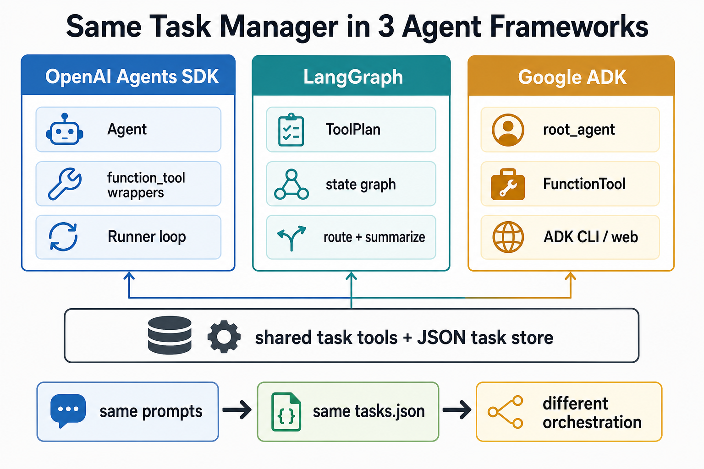

# Same Task Manager Agent in 3 Frameworks

This repository implements the same small task manager agent three ways:

- **OpenAI Agents SDK**: agent + decorated tools + `Runner` loop
- **LangGraph**: explicit state + nodes + edges + conditional routing
- **Google ADK**: discoverable `root_agent` + `FunctionTool` wrappers + ADK runtime

All three versions call the same shared task functions and write to the same local JSON task database. The point of the repo is to compare orchestration style while keeping the user problem, tool behavior, and storage layer constant.



## How the Code Is Organized

```text
.
+-- shared/
|   +-- task_store.py      # JSON-backed TaskStore and Task dataclass
|   +-- task_tools.py      # Framework-neutral task functions
+-- openai_agents_app/
|   +-- main.py            # OpenAI Agents SDK implementation
+-- langgraph_app/
|   +-- main.py            # LangGraph implementation
+-- google_adk_app/
|   +-- agent.py           # Google ADK implementation
+-- tasks.json             # Local task database, created/updated at runtime
```

## Shared Task Layer

`shared/task_store.py` contains the durable task model:

- `TaskStore.add_task()` validates title and priority, assigns the next id, and writes a pending task.
- `TaskStore.list_tasks()` returns pending, done, or all tasks.
- `TaskStore.mark_task_done()` updates status and completion time.
- `TaskStore.update_task()` edits allowed fields: `title`, `due_date`, `priority`, and `status`.
- `TaskStore.clear_all()` resets the demo database.

`shared/task_tools.py` exposes those operations as simple Python functions that return JSON strings. These functions are intentionally framework-neutral, so each agent framework can reuse the same behavior without duplicating task logic.

The task database defaults to `./tasks.json`. Set `TASKS_DB_PATH` if you want to store it somewhere else.

## Framework Comparison

| Framework | Main file | Orchestration model | How tools are exposed |
| --- | --- | --- | --- |
| OpenAI Agents SDK | `openai_agents_app/main.py` | A single `Agent` receives instructions, tools, and conversation history. `Runner.run()` drives the loop. | Shared functions are wrapped with `@function_tool`. |
| LangGraph | `langgraph_app/main.py` | A `StateGraph` runs `plan -> route -> execute_tool -> summarize`, with clarification and direct response branches. | The planner returns a structured `ToolPlan`; graph nodes call shared functions directly. |
| Google ADK | `google_adk_app/agent.py` | ADK discovers `root_agent` and runs it through the CLI or web UI. | Shared functions are wrapped with `FunctionTool`. |

## Setup

Create an environment and install dependencies:

```bash
python -m venv .venv
source .venv/bin/activate
pip install -r requirements.txt
```

Or, if you use `uv`:

```bash
uv sync
```

Copy the example environment file:

```bash
cp .env.example .env
```

Fill in the keys needed for the examples you want to run:

```bash
OPENAI_API_KEY=...
GOOGLE_API_KEY=...
GOOGLE_GENAI_USE_VERTEXAI=FALSE
```

Optional runtime settings:

```bash
TASKS_DB_PATH=./tasks.json
SHOW_TOOL_LOGS=1
```

`SHOW_TOOL_LOGS=1` prints tool input and output in the terminal, which is useful when recording a framework comparison.

## Run the OpenAI Agents SDK Version

```bash
python -m openai_agents_app.main
```

This version defines one `task_agent`, decorates the shared task functions as SDK tools, keeps conversation history in memory, and passes each turn to `Runner.run()`.

## Run the LangGraph Version

```bash
python -m langgraph_app.main
```

This version makes the control flow explicit:

```text
START -> plan -> route -> execute_tool -> summarize -> END
                    +-- clarify -> END
                    +-- respond -> END
```

The planner model emits a structured `ToolPlan`, `route_after_plan()` chooses the next graph branch, `execute_tool_node()` calls the shared task functions, and `summarize_node()` turns the JSON tool result into a concise user response.

Running this app also writes `graph.png`, a generated LangGraph-only diagram.

## Run the Google ADK Version

From the repo root:

```bash
adk run google_adk_app
```

Or use the web UI:

```bash
adk web .
```

ADK discovers `root_agent` in `google_adk_app/agent.py`. The agent uses Gemini, the same practical task-manager instructions, and `FunctionTool` wrappers around the shared task functions.

## Demo Prompts

Try the same prompts in each implementation:

```text
Add a high priority task to record the LangGraph section tomorrow morning.
List my pending tasks.
What should I focus on today?
Mark task 1 done.
Change task 2 priority to high.
Clear all tasks.
```

## Recording Angle

Use the same prompt sequence in all three frameworks.

The comparison line:

> Same tools. Same task store. Same user problem. Different agent architecture.
